# 🔒 DevSecOps: Automated Security Testing Pipeline

> **Shifting Left: Automated Security Testing within the DevSecOps Pipeline**

A comprehensive demonstration of implementing automated security testing in a DevSecOps pipeline, addressing security vulnerabilities early in the software development lifecycle.


## 📋 Table of Contents

- [Problem Statement](#-problem-statement)
- [Solution Overview](#-solution-overview)
- [Architecture](#-architecture)
- [Security Tools](#-security-tools)
- [Quick Start](#-quick-start)
- [Local Development](#-local-development)
- [CI/CD Pipeline](#-cicd-pipeline)
- [Project Structure](#-project-structure)
- [Demo & Verification](#-demo--verification)

## 🚨 Problem Statement

### Real-World Consequence: The Equifax Breach

Consider the **Equifax breach** in 2017. Exploitation of a known, unpatched vulnerability (Apache Struts CVE-2017-5638) cost them:
- **💰 $1.4 billion** in fines and settlements
- **📉 Massive reputational damage**
- **🔓 Personal data of 147 million people compromised**

This stark example demonstrates the financial and social fallout from neglecting early-stage security.

### Traditional Security Challenges

1. **Security as an Afterthought**
   - Historically, security is often addressed late in the software development lifecycle
   - Testing done only before deployment or after incidents occur

2. **Expensive and Time-Consuming Remediation**
   - Identifying and fixing vulnerabilities at late stages requires significant rework
   - Causes substantial project delays and budget overruns
   - **Cost increases 10-100x** when bugs are found in production vs. development

3. **Increased Security Risks**
   - Applications with deeply embedded vulnerabilities are prime targets for attacks
   - Late-stage fixes may miss systemic security design flaws
   - Potential for major financial losses and data breaches

## 💡 Solution Overview

### Introducing **DevSecOps**

DevSecOps emphasizes **collaboration** and **automation**, embedding security practices and testing from the earliest stages of development.

### **"Shift Left" Security Approach**

By moving security testing to the left (earlier) in the development pipeline, we:
- ✅ **Detect vulnerabilities early** - before they reach production
- 💰 **Reduce remediation costs** - fixing issues in development is 100x cheaper
- ⚡ **Accelerate delivery** - no last-minute security delays
- 🛡️ **Improve security posture** - multiple layers of automated protection

### Integrated Security Tools

This project demonstrates three essential security testing tools:

| Tool | Type | Purpose |
|------|------|---------|
| **OWASP Dependency-Check** | SCA (Software Composition Analysis) | Identifies known vulnerabilities in project dependencies using the National Vulnerability Database (NVD) |
| **SonarQube** | SAST (Static Application Security Testing) | Performs static analysis of source code to detect security vulnerabilities, code smells, and bugs |
| **Trivy** | Container & Filesystem Scanner | Scans container images and filesystems for OS package vulnerabilities and misconfigurations |

## 🏗️ Architecture

### Pipeline Flow

```mermaid
graph TB
    A[Developer Commits Code] --> B[GitHub Actions Triggered]
    B --> C{Security Scans}
    
    C --> D[OWASP Dependency-Check<br/>SCA]
    C --> E[SonarQube<br/>SAST]
    C --> F[Build Docker Image]
    
    D --> G{Vulnerabilities<br/>Found?}
    E --> H{Code Quality<br/>Issues?}
    F --> I[Trivy Container Scan]
    
    I --> J{Container<br/>Vulnerabilities?}
    
    G -->|Critical| K[❌ Fail Build]
    H -->|No| L[✅ Quality Gate Passed]
    J -->|No Critical| M[✅ Deploy to EC2]
    
    G -->|None/Low| L
    J -->|Critical| K
    
    K --> N[Generate Reports]
    L --> M
    M --> N
    
    N --> O[Security Summary]
    
    style K fill:#ff6b6b
    style M fill:#51cf66
    style D fill:#4dabf7
    style E fill:#4dabf7
    style I fill:#4dabf7
```



### Security Layers

1. **Layer 1: Dependency Scanning (OWASP Dependency-Check)**
   - Scans `package.json` and `node_modules`
   - Checks against National Vulnerability Database (NVD)
   - Identifies CVEs in third-party libraries

2. **Layer 2: Source Code Analysis (SonarQube)**
   - Static analysis of JavaScript/Node.js code
   - Detects security hotspots, vulnerabilities, and code smells
   - Enforces code quality gates

3. **Layer 3: Container Security (Trivy)**
   - Scans Docker images for OS vulnerabilities
   - Detects misconfigurations
   - Identifies secrets in code

## 🔧 Security Tools

### 1. OWASP Dependency-Check (SCA)

**Purpose**: Modern applications rely heavily on external libraries and frameworks. Dependency-Check uses a regularly updated database to identify vulnerable components.

**Key Features**:
- 📊 Scans dependencies against the NVD
- 🔍 Identifies CVE numbers and severity scores
- 📈 Generates detailed HTML/JSON reports
- ⚠️ Configurable failure thresholds (CVSS scores)

**Configuration**: See [`dependency-check-config.xml`](.github/workflows/devsecops-pipeline.yml)

### 2. SonarQube (SAST)

**Purpose**: Performs static analysis of the source code before deployment, detects a range of potential vulnerabilities, and provides immediate feedback to developers.

**Key Features**:
- 🐛 Detects bugs, code smells, and security vulnerabilities
- 📊 Code quality metrics and technical debt calculation
- 🚦 Quality gates to enforce standards
- 📈 Trend analysis over time

**Configuration**: See [`sonar-project.properties`](sonar-project.properties)

### 3. Trivy (Container & Filesystem Scanner)

**Purpose**: Integrated into the CI/CD pipeline to automatically scan file systems and containers before deployment, preventing vulnerable components from reaching production.

**Key Features**:
- 🐳 Comprehensive container image scanning
- 📦 OS package vulnerability detection
- 🔐 Secret detection in code and configs
- ⚡ Fast and easy to integrate

**Configuration**: See [`trivy.yaml`](trivy.yaml)

## 🚀 Quick Start

### Prerequisites

- **Node.js** 18+ ([Download](https://nodejs.org/))
- **Docker** & Docker Compose ([Download](https://www.docker.com/))
- **Git** ([Download](https://git-scm.com/))

### Installation

1. **Clone the repository**
   ```bash
   git clone <your-repo-url>
   cd APPLIED-DEVOPS
   ```

2. **Install dependencies**
   ```bash
   npm install
   ```

3. **Create environment file**
   ```bash
   cp .env.example .env
   ```

4. **Run the application**
   ```bash
   npm start
   ```

   The API will be available at `http://localhost:3000`

### Test the API

```bash
# Health check
curl http://localhost:3000/api/health

# View API documentation
curl http://localhost:3000/api/docs
```

## 🔨 Local Development

### Running Security Scans Locally

#### On Windows (PowerShell)
```powershell
.\scripts\run-security-scans.ps1
```

#### On Linux/Mac (Bash)
```bash
chmod +x scripts/run-security-scans.sh
./scripts/run-security-scans.sh
```

### Manual Security Scans

#### 1. OWASP Dependency-Check
```bash
docker run --rm \
  -v "$(pwd):/src" \
  -v "$(pwd)/reports:/report" \
  owasp/dependency-check:latest \
  --scan /src \
  --format HTML \
  --project "DevSecOps Demo" \
  --out /report
```

#### 2. SonarQube (Local Instance)

Start SonarQube:
```bash
docker-compose up -d
```

Access SonarQube at `http://localhost:9000` (Login: admin/admin)

Run analysis:
```bash
npx sonar-scanner \
  -Dsonar.login=YOUR_TOKEN \
  -Dsonar.host.url=http://localhost:9000
```

#### 3. Trivy Scans

Install Trivy:
- **Windows**: `choco install trivy`
- **Mac**: `brew install trivy`
- **Linux**: See [Trivy Installation](https://aquasecurity.github.io/trivy/latest/getting-started/installation/)

Scan filesystem:
```bash
trivy fs --severity HIGH,CRITICAL .
```

Scan Docker image:
```bash
docker build -t devsecops-demo:local .
trivy image devsecops-demo:local
```

## 🔄 CI/CD Pipeline

### GitHub Actions Workflow

The automated pipeline runs on every push and pull request:

**Workflow Steps**:

1. **OWASP Dependency-Check** 
   - Scans dependencies for known vulnerabilities
   - Fails on CVSS score ≥ 7

2. **SonarQube Analysis**
   - Performs static code analysis
   - Checks quality gates

3. **Docker Build**
   - Builds container image
   - Uses multi-stage builds for optimization

4. **Trivy Security Scan**
   - Scans filesystem for vulnerabilities
   - Scans container image
   - Uploads results to GitHub Security tab

5. **Security Summary**
   - Generates comprehensive security report
   - Posts results as PR comments

### Setup GitHub Actions

1. **Fork this repository**

2. **Add GitHub Secrets** (Settings → Secrets and variables → Actions)
   
   Required secrets:
   - `SONAR_TOKEN`: Your SonarQube token (if using SonarCloud)
   - `SONAR_HOST_URL`: Your SonarQube server URL
   - `DOCKERHUB_USERNAME`: Docker Hub username (optional)
   - `DOCKERHUB_TOKEN`: Docker Hub access token (optional)

3. **Enable GitHub Actions**
   - Go to Actions tab
   - Enable workflows

4. **Push code** - Pipeline runs automatically!

### Viewing Reports

After pipeline execution:
1. Go to **Actions** tab
2. Click on the latest workflow run
3. Download artifacts:
   - `dependency-check-report`
   - `trivy-reports`
4. View Security tab for Trivy findings

## 📁 Project Structure

```
APPLIED DEVOPS/
├── .github/
│   └── workflows/
│       └── devsecops-pipeline.yml    # CI/CD pipeline configuration
├── docs/
│   └── ARCHITECTURE.md               # Detailed architecture documentation
├── scripts/
│   ├── run-security-scans.sh         # Linux/Mac security scan script
│   └── run-security-scans.ps1        # Windows security scan script
├── app.js                            # Main Express.js application
├── package.json                      # Node.js dependencies
├── Dockerfile                        # Multi-stage Docker build
├── docker-compose.yml                # Local SonarQube setup
├── sonar-project.properties          # SonarQube configuration
├── trivy.yaml                        # Trivy scan configuration
├── .env.example                      # Environment variables template
├── .dockerignore                     # Docker ignore patterns
├── .gitignore                        # Git ignore patterns
└── README.md                         # This file
```

## 🎯 Demo & Verification

### Expected Vulnerabilities (For Demonstration)

This project intentionally includes:
- **Lodash 4.17.19** - Contains known CVE (Prototype Pollution)
- Demonstrates how OWASP Dependency-Check catches vulnerable dependencies

### Security Scan Results

After running the security scans, you should see:

1. **OWASP Dependency-Check**: Identifies CVE in lodash
2. **SonarQube**: Code quality metrics and security hotspots
3. **Trivy**: Container vulnerabilities (if any in base image)

### Screenshots

You can find verification screenshots in the [`docs/`](docs/) folder:
- Pipeline execution
- OWASP Dependency-Check report
- SonarQube dashboard
- Trivy scan results

## 🎓 Learning Outcomes

This project demonstrates:

✅ **DevSecOps Principles**
- Security integrated from the start
- Automated security testing
- Continuous security monitoring

✅ **Shift-Left Security Benefits**
- Early vulnerability detection
- Reduced remediation costs
- Faster, safer deployments

✅ **CI/CD Security Integration**
- Automated security gates
- Multiple security layers
- Comprehensive reporting

✅ **Industry Best Practices**
- Multi-stage Docker builds
- Non-root containers
- Dependency scanning
- Static code analysis
- Container security

## 📚 References

- [OWASP Dependency-Check](https://owasp.org/www-project-dependency-check/)
- [SonarQube Documentation](https://docs.sonarqube.org/)
- [Trivy Documentation](https://aquasecurity.github.io/trivy/)
- [DevSecOps Best Practices](https://www.devsecops.org/)
- [Equifax Data Breach Report](https://www.ftc.gov/equifax-data-breach)

## 📄 License

This project is licensed under the MIT License - see LICENSE file for details.

## 👥 Contributors

DevSecOps Team - Applied DevOps Project

---

**⭐ If this project helped you understand DevSecOps, please give it a star!**

**🔒 Remember: Security is not a feature, it's a mindset!**
