# DevSecOps Architecture

## 🏗️ System Architecture Overview

This document provides detailed architectural information about the DevSecOps automated security testing pipeline.

## 📐 High-Level Architecture

### Component Diagram


## 🔄 Security Pipeline Workflow

### Sequential Flow


## 🔧 Technology Stack

### Application Layer

| Component | Technology | Purpose |
|-----------|-----------|---------|
| Runtime | Node.js 18+ | JavaScript runtime environment |
| Framework | Express.js | Web application framework |
| Authentication | JWT + bcrypt | Secure authentication |
| Validation | Joi | Input validation |
| Security | Helmet.js | HTTP security headers |
| Rate Limiting | express-rate-limit | DDoS protection |

### Security Tools Layer

| Tool | Version | Type | Database |
|------|---------|------|----------|
| OWASP Dependency-Check | Latest | SCA | National Vulnerability Database (NVD) |
| SonarQube | 10+ Community | SAST | Built-in security rules |
| Trivy | Latest | Container Scanner | Aqua Security Vulnerability DB |

### Infrastructure Layer

| Component | Technology | Purpose |
|-----------|-----------|---------|
| Containerization | Docker | Application packaging |
| CI/CD | GitHub Actions | Automation pipeline |
| Version Control | Git/GitHub | Source code management |
| Orchestration | Docker Compose | Local development |

## 🔐 Security Architecture

### Defense in Depth Strategy


### Security Scanning Coverage

#### 1. OWASP Dependency-Check (SCA)

**What it scans**:
- `package.json` dependencies
- `node_modules` directory
- Direct and transitive dependencies

**Detection method**:
- Matches dependencies against NVD
- Generates CPE (Common Platform Enumeration) names
- Cross-references with CVE database

**Output**:
- HTML report with CVE details
- JSON report for automation
- CVSS scores and severity ratings

#### 2. SonarQube (SAST)

**What it analyzes**:
- JavaScript/Node.js source code
- Code complexity and maintainability
- Security hotspots
- Code smells and bugs

**Analysis types**:
- **Security**: SQL injection, XSS, authentication issues
- **Reliability**: Bugs and error handling
- **Maintainability**: Code complexity, duplications
- **Coverage**: Test coverage metrics

**Quality Gates**:
- Configurable thresholds
- New code focus
- Technical debt ratio

#### 3. Trivy (Container & Filesystem Scanner)

**What it scans**:
- Container images (layers)
- Operating system packages
- Application dependencies
- Configuration files
- Secrets in code

**Vulnerability sources**:
- Alpine Linux security database
- Debian security tracker
- Red Hat security data
- GitHub Advisory Database

**Special features**:
- Secret detection (API keys, passwords)
- Misconfiguration detection
- License scanning

## 📊 Data Flow

### Vulnerability Detection Flow

```mermaid
flowchart TD
    START[Code Commit] --> SCAN1[Dependency Scan]
    START --> SCAN2[Code Analysis]
    START --> SCAN3[Build Image]
    
    SCAN1 --> CHECK1{Vulnerable<br/>Dependencies?}
    SCAN2 --> CHECK2{Code<br/>Issues?}
    SCAN3 --> SCAN4[Container Scan]
    
    SCAN4 --> CHECK3{Container<br/>Vulnerabilities?}
    
    CHECK1 -->|Yes| REPORT1[Generate CVE Report]
    CHECK2 -->|Yes| REPORT2[Generate Code Report]
    CHECK3 -->|Yes| REPORT3[Generate Trivy Report]
    
    CHECK1 -->|No| PASS
    CHECK2 -->|No| PASS
    CHECK3 -->|No| PASS
    
    REPORT1 --> ASSESS[Assess Severity]
    REPORT2 --> ASSESS
    REPORT3 --> ASSESS
    
    ASSESS --> CRITICAL{Critical<br/>Issues?}
    
    CRITICAL -->|Yes| FAIL[❌ Fail Build]
    CRITICAL -->|No| PASS[✅ Pass Build]
    
    PASS --> DEPLOY[Deploy]
    FAIL --> NOTIFY[Notify Developer]
    
    style FAIL fill:#ff6b6b
    style PASS fill:#51cf66
    style DEPLOY fill:#51cf66
```



## 🚀 Deployment Architecture

### Container Architecture

```dockerfile
# Multi-stage build for security and efficiency

Stage 1: Builder
- Install all dependencies
- Copy source code

Stage 2: Production
- Minimal Alpine base image
- Only production dependencies
- Non-root user
- Health checks
- Exposed ports
```

### Security Features

**Container Security**:
- ✅ Non-root user (nodejs:1001)
- ✅ Minimal attack surface (Alpine Linux)
- ✅ Multi-stage builds (smaller image)
- ✅ Health checks for reliability
- ✅ No unnecessary packages

**Application Security**:
- ✅ JWT authentication
- ✅ Password hashing (bcrypt)
- ✅ Input validation (Joi)
- ✅ Rate limiting
- ✅ Security headers (Helmet)
- ✅ CORS configuration
- ✅ Environment-based configs

## 📈 Scalability Considerations

### Horizontal Scaling
- Stateless application design
- JWT tokens (no session storage)
- Container-ready architecture

### CI/CD Performance
- Parallel security scans
- Docker layer caching
- Scan result caching (Trivy)
- Incremental analysis (SonarQube)

## 🔄 Continuous Improvement

### Monitoring Points

1. **Build Time**: Track pipeline duration
2. **Vulnerability Trends**: Monitor over time
3. **Quality Metrics**: Code quality evolution
4. **False Positives**: Track and tune rules

### Feedback Loops


## 🎯 Design Decisions

### Why These Tools?

1. **OWASP Dependency-Check**
   - ✅ Free and open source
   - ✅ Comprehensive NVD coverage
   - ✅ Easy GitHub Actions integration
   - ✅ Multiple output formats

2. **SonarQube**
   - ✅ Industry-standard SAST
   - ✅ Extensive language support
   - ✅ Quality gates
   - ✅ Free community edition

3. **Trivy**
   - ✅ Fast and accurate
   - ✅ Container-focused
   - ✅ Secret detection
   - ✅ Easy to use

### Trade-offs

| Aspect | Choice | Trade-off |
|--------|--------|-----------|
| Build Time | Comprehensive scans | +2-3 minutes to pipeline |
| Accuracy | Multiple tools | Some overlap in findings |
| Maintenance | Auto-updates | May introduce breaking changes |
| Storage | Keep reports 30 days | GitHub storage costs |

## 📚 References

- [OWASP DevSecOps Guideline](https://owasp.org/www-project-devsecops-guideline/)
- [NIST Secure Software Development Framework](https://csrc.nist.gov/projects/ssdf)
- [Docker Security Best Practices](https://docs.docker.com/develop/security-best-practices/)
- [GitHub Actions Security](https://docs.github.com/en/actions/security-guides)

---

**Document Version**: 1.0  
**Last Updated**: 2025-12-05  
**Maintained By**: DevSecOps Team
